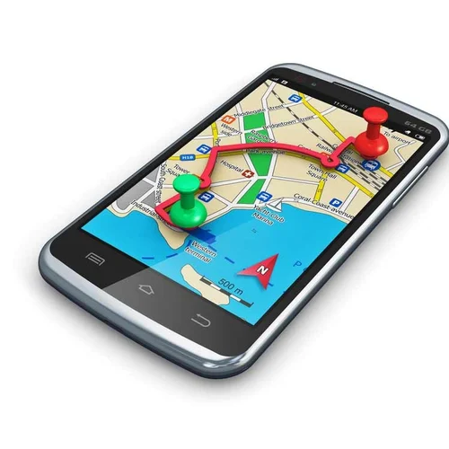

# Amritanshu Kumar Portfolio

This is a personal portfolio website showcasing my skills, projects, and experience in cybersecurity.

## How to Update This Portfolio

### Personal Information
- **Name and Title**: Edit in `index.html` (look for `<!-- UPDATE: Your Name -->` comments)
- **About Me**: Update your bio in the About section in `index.html`
- **Contact Information**: Change email, phone, location in the Contact section
- **Social Links**: Update your social media links in the Contact section

### Projects
- **Project Images**: Replace images in the `/public/images/` folder
- **Project Details**: Edit project titles, descriptions, and links in the Projects section
- **Project Categories**: Modify project categories in the data-category attributes

### Skills
- **Skill Levels**: Adjust your skill percentages in the data-skill-level attributes
- **Programming Languages**: Add or remove skill tags in the Skills section

### Experience
- **Work History**: Update your job titles, companies, and descriptions in the Experience section

### Resume
- **CV/Resume**: Replace the file at `/public/images/resume.pdf` with your updated resume

### Styling
- **Colors**: Customize the color scheme by editing the CSS variables in `styles.css`
- **Fonts**: Change fonts by updating the font-family properties in `styles.css`
- **Images**: Replace the profile image placeholder with your photo

## File Structure
- `index.html` - Main HTML structure and content
- `styles.css` - All styling and theme settings
- `script.js` - Interactive functionality
- `/public/images/` - All images and downloadable files
\`\`\`

Now, let's update the HTML file with clear update markers:

```html file="index.html" type="html"
&lt;!DOCTYPE html>
<html lang="en">
<head>
    <meta charset="UTF-8">
    <meta name="viewport" content="width=device-width, initial-scale=1.0">
    &lt;!-- UPDATE: Your page title -->
    <title>Amritanshu Kumar | Cybersecurity Professional</title>
    <link rel="stylesheet" href="styles.css">
    <link rel="stylesheet" href="https://cdnjs.cloudflare.com/ajax/libs/font-awesome/6.4.0/css/all.min.css">
</head>
<body class="light-mode">
    &lt;!-- Header Section - Update your name and navigation items -->
    <header>
        <div class="container">
            <div class="logo">
                &lt;!-- UPDATE: Your Name -->
                <h1>Amritanshu<span>Kumar</span></h1>
            </div>
            <nav>
                <ul class="nav-links">
                    &lt;!-- UPDATE: Navigation links - add or remove as needed -->
                    <li><a href="#home">Home</a></li>
                    <li><a href="#about">About</a></li>
                    <li><a href="#skills">Skills</a></li>
                    <li><a href="#projects">Projects</a></li>
                    <li><a href="#experience">Experience</a></li>
                    <li><a href="#contact">Contact</a></li>
                    <li>
                        <button id="theme-toggle" class="theme-toggle">
                            <i class="fas fa-moon"></i>
                        </button>
                    </li>
                </ul>
                <div class="hamburger">
                    <span class="bar"></span>
                    <span class="bar"></span>
                    <span class="bar"></span>
                </div>
            </nav>
        </div>
    </header>

    &lt;!-- Hero Section - Update your introduction -->
    <section id="home" class="hero">
        <div class="container">
            <div class="hero-content">
                &lt;!-- UPDATE: Your name and headline -->
                <h1>Hello, I'm <span>Amritanshu Kumar</span></h1>
                <h2>Cybersecurity Specialist</h2>
                &lt;!-- UPDATE: Your short description -->
                <p>B.Tech CSE Student at LPU with a focus on Cybersecurity</p>
                <div class="hero-buttons">
                    &lt;!-- UPDATE: Your call-to-action buttons -->
                    <a href="#projects" class="btn primary-btn">View Projects</a>
                    <a href="#contact" class="btn secondary-btn">Contact Me</a>
                    &lt;!-- UPDATE: Your resume file path -->
                    <a href="public/images/resume.pdf" download class="btn accent-btn">
                        <i class="fas fa-download"></i> Download CV
                    </a>
                </div>
            </div>
            <div class="hero-image">
                &lt;!-- UPDATE: Replace with your profile image -->
                <div class="profile-img-placeholder">
                    &lt;!-- Replace this icon with your image by uncommenting the img tag below -->
                    <i class="fas fa-user-circle"></i>
                    &lt;!--  -->
                </div>
            </div>
        </div>
    </section>

    &lt;!-- About Section - Update your biography -->
    <section id="about" class="about">
        <div class="container">
            <div class="section-header">
                <h2>About Me</h2>
                <div class="underline"></div>
            </div>
            <div class="about-content">
                <div class="about-text">
                    &lt;!-- UPDATE: Your biography paragraphs -->
                    <p>I am Amritanshu Kumar, a B.Tech CSE student at Lovely Professional University specializing in Cybersecurity. My passion lies in developing secure applications and exploring the ever-evolving field of information security.</p>
                    <p>With hands-on experience in developing security-focused applications and a strong foundation in computer science, I am dedicated to creating innovative solutions that protect digital assets and information.</p>
                    <div class="about-details">
                        &lt;!-- UPDATE: Your education details -->
                        <div class="detail-item">
                            <i class="fas fa-graduation-cap"></i>
                            <div>
                                <h3>Education</h3>
                                <p>B.Tech in Computer Science & Engineering</p>
                                <p>Lovely Professional University</p>
                            </div>
                        </div>
                        &lt;!-- UPDATE: Your specialization -->
                        <div class="detail-item">
                            <i class="fas fa-shield-alt"></i>
                            <div>
                                <h3>Specialization</h3>
                                <p>Cybersecurity</p>
                            </div>
                        </div>
                        &lt;!-- ADD MORE DETAILS: Uncomment and customize this section for additional details
                        <div class="detail-item">
                            <i class="fas fa-certificate"></i>
                            <div>
                                <h3>Certifications</h3>
                                <p>Your certification</p>
                            </div>
                        </div>
                        -->
                    </div>
                </div>
            </div>
        </div>
    </section>

    &lt;!-- Skills Section - Update your skills and proficiency levels -->
    <section id="skills" class="skills">
        <div class="container">
            <div class="section-header">
                <h2>My Skills</h2>
                <div class="underline"></div>
            </div>
            <div class="skills-content">
                <div class="skill-category">
                    <h3>Technical Skills</h3>
                    <div class="skill-items">
                        &lt;!-- UPDATE: Your skill levels - change data-skill-level attribute to update the percentage -->
                        <div class="skill-item" data-skill-level="90">
                            <div class="skill-name">Cybersecurity</div>
                            <div class="skill-bar">
                                <div class="skill-level" style="width: 0%"></div>
                            </div>
                            <div class="skill-percentage">90%</div>
                        </div>
                        <div class="skill-item" data-skill-level="85">
                            <div class="skill-name">Network Security</div>
                            <div class="skill-bar">
                                <div class="skill-level" style="width: 0%"></div>
                            </div>
                            <div class="skill-percentage">85%</div>
                        </div>
                        <div class="skill-item" data-skill-level="80">
                            <div class="skill-name">Programming</div>
                            <div class="skill-bar">
                                <div class="skill-level" style="width: 0%"></div>
                            </div>
                            <div class="skill-percentage">80%</div>
                        </div>
                        <div class="skill-item" data-skill-level="75">
                            <div class="skill-name">Web Development</div>
                            <div class="skill-bar">
                                <div class="skill-level" style="width: 0%"></div>
                            </div>
                            <div class="skill-percentage">75%</div>
                        </div>
                        <div class="skill-item" data-skill-level="80">
                            <div class="skill-name">Mobile App Security</div>
                            <div class="skill-bar">
                                <div class="skill-level" style="width: 0%"></div>
                            </div>
                            <div class="skill-percentage">80%</div>
                        </div>
                        &lt;!-- ADD MORE SKILLS: Copy and paste the skill-item div and customize -->
                    </div>
                </div>
                <div class="skill-category">
                    <h3>Programming Languages</h3>
                    <div class="skill-tags">
                        &lt;!-- UPDATE: Your programming languages - add or remove span elements -->
                        <span class="skill-tag">HTML</span>
                        <span class="skill-tag">CSS</span>
                        <span class="skill-tag">JavaScript</span>
                        <span class="skill-tag">Python</span>
                        <span class="skill-tag">Java</span>
                        <span class="skill-tag">C++</span>
                        &lt;!-- ADD MORE LANGUAGES: Copy and paste the span element and change the text -->
                    </div>
                </div>
            </div>
        </div>
    </section>

    &lt;!-- Projects Section - Update your projects -->
    <section id="projects" class="projects">
        <div class="container">
            <div class="section-header">
                <h2>My Projects</h2>
                <div class="underline"></div>
            </div>
            
            <div class="project-filters">
                &lt;!-- UPDATE: Project categories - add or remove button elements -->
                <button class="filter-btn active" data-filter="all">All</button>
                <button class="filter-btn" data-filter="ai">AI</button>
                <button class="filter-btn" data-filter="security">Security</button>
                <button class="filter-btn" data-filter="mobile">Mobile</button>
                &lt;!-- ADD MORE FILTERS: Copy and paste the button element and change the text and data-filter attribute -->
            </div>
            
            <div class="projects-grid">
                &lt;!-- PROJECT 1: Update project details -->
                <div class="project-card" data-category="ai">
                    <div class="project-img">
                        &lt;!-- UPDATE: Project image path -->
                        
                        <div class="project-overlay">
                            <a href="#" class="view-project">
                                <i class="fas fa-eye"></i>
                            </a>
                        </div>
                    </div>
                    <div class="project-info">
                        &lt;!-- UPDATE: Project title -->
                        <h3>AI Chatbot</h3>
                        &lt;!-- UPDATE: Project description -->
                        <p>Developed an intelligent chatbot using natural language processing to provide automated customer support and information retrieval.</p>
                        <div class="project-tech">
                            &lt;!-- UPDATE: Technologies used - add or remove span elements -->
                            <span>Python</span>
                            <span>NLP</span>
                            <span>Machine Learning</span>
                        </div>
                        <div class="project-links">
                            &lt;!-- UPDATE: Project links - update href attributes -->
                            <a href="https://github.com/yourusername/ai-chatbot" target="_blank" class="project-link">
                                <i class="fab fa-github"></i> GitHub
                            </a>
                            <a href="#" class="project-link">
                                <i class="fas fa-external-link-alt"></i> Live Demo
                            </a>
                        </div>
                    </div>
                </div>

                &lt;!-- PROJECT 2: Update project details -->
                <div class="project-card" data-category="security">
                    <div class="project-img">
                        &lt;!-- UPDATE: Project image path -->
                        
                        <div class="project-overlay">
                            <a href="#" class="view-project">
                                <i class="fas fa-eye"></i>
                            </a>
                        </div>
                    </div>
                    <div class="project-info">
                        &lt;!-- UPDATE: Project title -->
                        <h3>Secure Chat Software</h3>
                        &lt;!-- UPDATE: Project description -->
                        <p>Built an end-to-end encrypted chat application with focus on privacy and security for sensitive communications.</p>
                        <div class="project-tech">
                            &lt;!-- UPDATE: Technologies used - add or remove span elements -->
                            <span>JavaScript</span>
                            <span>Encryption</span>
                            <span>WebSockets</span>
                        </div>
                        <div class="project-links">
                            &lt;!-- UPDATE: Project links - update href attributes -->
                            <a href="https://github.com/yourusername/secure-chat" target="_blank" class="project-link">
                                <i class="fab fa-github"></i> GitHub
                            </a>
                            <a href="#" class="project-link">
                                <i class="fas fa-external-link-alt"></i> Live Demo
                            </a>
                        </div>
                    </div>
                </div>

                &lt;!-- PROJECT 3: Update project details -->
                <div class="project-card" data-category="mobile">
                    <div class="project-img">
                        &lt;!-- UPDATE: Project image path -->
                        
                        <div class="project-overlay">
                            <a href="#" class="view-project">
                                <i class="fas fa-eye"></i>
                            </a>
                        </div>
                    </div>
                    <div class="project-info">
                        &lt;!-- UPDATE: Project title -->
                        <h3>Mobile Tracking Software</h3>
                        &lt;!-- UPDATE: Project description -->
                        <p>Developed a secure mobile tracking solution with privacy controls and location monitoring capabilities.</p>
                        <div class="project-tech">
                            &lt;!-- UPDATE: Technologies used - add or remove span elements -->
                            <span>Java</span>
                            <span>Android</span>
                            <span>GPS</span>
                        </div>
                        <div class="project-links">
                            &lt;!-- UPDATE: Project links - update href attributes -->
                            <a href="https://github.com/yourusername/mobile-tracker" target="_blank" class="project-link">
                                <i class="fab fa-github"></i> GitHub
                            </a>
                            <a href="#" class="project-link">
                                <i class="fas fa-external-link-alt"></i> Live Demo
                            </a>
                        </div>
                    </div>
                </div>

                &lt;!-- ADD NEW PROJECT: Copy and paste this template and customize
                <div class="project-card" data-category="your-category">
                    <div class="project-img">
                        
                        <div class="project-overlay">
                            <a href="#" class="view-project">
                                <i class="fas fa-eye"></i>
                            </a>
                        </div>
                    </div>
                    <div class="project-info">
                        <h3>Project Name</h3>
                        <p>Project description goes here.</p>
                        <div class="project-tech">
                            <span>Technology 1</span>
                            <span>Technology 2</span>
                            <span>Technology 3</span>
                        </div>
                        <div class="project-links">
                            <a href="https://github.com/yourusername/project-repo" target="_blank" class="project-link">
                                <i class="fab fa-github"></i> GitHub
                            </a>
                            <a href="#" class="project-link">
                                <i class="fas fa-external-link-alt"></i> Live Demo
                            </a>
                        </div>
                    </div>
                </div>
                -->
            </div>
        </div>
    </section>

    &lt;!-- Experience Section - Update your work experience -->
    <section id="experience" class="experience">
        <div class="container">
            <div class="section-header">
                <h2>Work Experience</h2>
                <div class="underline"></div>
            </div>
            <div class="timeline">
                &lt;!-- EXPERIENCE 1: Update job details -->
                <div class="timeline-item">
                    <div class="timeline-dot"></div>
                    <div class="timeline-content">
                        &lt;!-- UPDATE: Job title -->
                        <h3>Event Lead</h3>
                        &lt;!-- UPDATE: Company name -->
                        <h4>EventEye</h4>
                        &lt;!-- UPDATE: Employment period -->
                        <p class="timeline-date">Present</p>
                        &lt;!-- UPDATE: Job description -->
                        <p>Currently working as an Event Lead, managing and coordinating various events, ensuring security protocols are followed, and implementing technical solutions for event management.</p>
                    </div>
                </div>

                &lt;!-- EXPERIENCE 2: Update job details -->
                <div class="timeline-item">
                    <div class="timeline-dot"></div>
                    <div class="timeline-content">
                        &lt;!-- UPDATE: Job title -->
                        <h3>Secretary</h3>
                        &lt;!-- UPDATE: Company name -->
                        <h4>Oasis</h4>
                        &lt;!-- UPDATE: Employment period -->
                        <p class="timeline-date">2 Years</p>
                        &lt;!-- UPDATE: Job description -->
                        <p>Served as a Secretary for 2 years, handling administrative responsibilities, coordinating team activities, and managing documentation and communication channels.</p>
                    </div>
                </div>

                &lt;!-- ADD NEW EXPERIENCE: Copy and paste this template and customize
                <div class="timeline-item">
                    <div class="timeline-dot"></div>
                    <div class="timeline-content">
                        <h3>Job Title</h3>
                        <h4>Company Name</h4>
                        <p class="timeline-date">Time Period</p>
                        <p>Job description goes here.</p>
                    </div>
                </div>
                -->
            </div>
        </div>
    </section>

    &lt;!-- Contact Section - Update your contact information -->
    <section id="contact" class="contact">
        <div class="container">
            <div class="section-header">
                <h2>Contact Me</h2>
                <div class="underline"></div>
            </div>
            <div class="contact-content">
                <div class="contact-info">
                    &lt;!-- UPDATE: Your email -->
                    <div class="contact-item">
                        <i class="fas fa-envelope"></i>
                        <div>
                            <h3>Email</h3>
                            <p>amritanshu.kumar@example.com</p>
                        </div>
                    </div>
                    &lt;!-- UPDATE: Your phone number -->
                    <div class="contact-item">
                        <i class="fas fa-phone"></i>
                        <div>
                            <h3>Phone</h3>
                            <p>+91 XXXXXXXXXX</p>
                        </div>
                    </div>
                    &lt;!-- UPDATE: Your location -->
                    <div class="contact-item">
                        <i class="fas fa-map-marker-alt"></i>
                        <div>
                            <h3>Location</h3>
                            <p>Lovely Professional University, Punjab, India</p>
                        </div>
                    </div>
                    &lt;!-- UPDATE: Your social media links - update href attributes -->
                    <div class="social-links">
                        <a href="#" class="social-link"><i class="fab fa-linkedin"></i></a>
                        <a href="#" class="social-link"><i class="fab fa-github"></i></a>
                        <a href="#" class="social-link"><i class="fab fa-twitter"></i></a>
                        &lt;!-- ADD MORE SOCIAL LINKS: Copy and paste the a element and change the icon and href -->
                    </div>
                </div>
                <div class="contact-form">
                    <form id="contactForm">
                        <div class="form-group">
                            <label for="name">Your Name</label>
                            <input type="text" id="name" placeholder="Enter your name" required>
                        </div>
                        <div class="form-group">
                            <label for="email">Your Email</label>
                            <input type="email" id="email" placeholder="Enter your email" required>
                        </div>
                        <div class="form-group">
                            <label for="subject">Subject</label>
                            <input type="text" id="subject" placeholder="Enter subject" required>
                        </div>
                        <div class="form-group">
                            <label for="message">Message</label>
                            <textarea id="message" placeholder="Enter your message" required></textarea>
                        </div>
                        <button type="submit" class="btn primary-btn submit-btn">
                            <i class="fas fa-paper-plane"></i> Send Message
                        </button>
                    </form>
                    <div id="form-status" class="form-status"></div>
                </div>
            </div>
        </div>
    </section>

    &lt;!-- Footer - Update copyright information -->
    <footer>
        <div class="container">
            <div class="footer-content">
                &lt;!-- UPDATE: Copyright year and your name -->
                <p>&copy; 2024 Amritanshu Kumar. All Rights Reserved.</p>
            </div>
        </div>
    </footer>

    &lt;!-- Project Modal - No need to update this section -->
    <div id="project-modal" class="modal">
        <div class="modal-content">
            <span class="close-modal">&times;</span>
            <div class="modal-body">
                
                <h3 id="modal-title"></h3>
                <p id="modal-description"></p>
            </div>
        </div>
    </div>

    &lt;!-- Back to Top Button - No need to update this section -->
    <button id="back-to-top" class="back-to-top">
        <i class="fas fa-arrow-up"></i>
    </button>

    <script src="script.js"></script>
</body>
</html>
